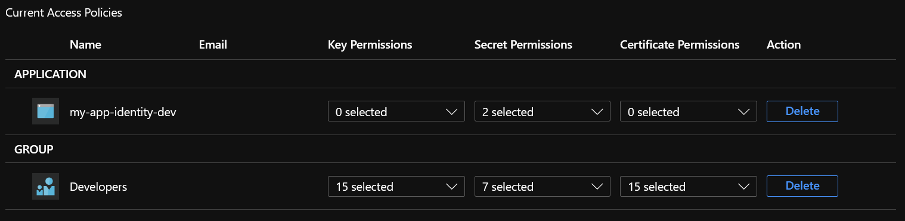
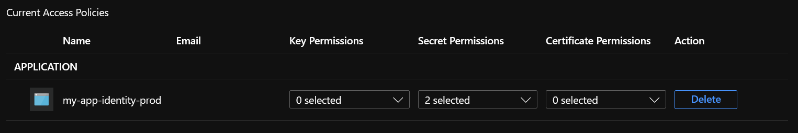
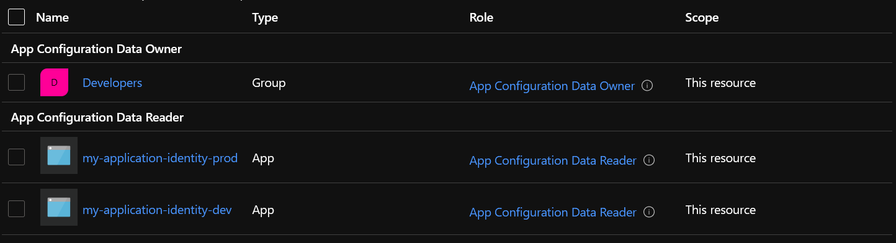

# Secret Management

## Keep secrets secret

If your secrets aren't part of your code, you need another way to make them available to your application when it is deployed. There are several secure ways, like injecting them at deploy time or configuring them directly in Azure's App Service or Function App's application settings.  
But how do they safely get onto the developer's machine? Every time a new developer starts on the team, there's this song and dance of getting them set up with everything they need to run the project locally, including getting them all the necessary secrets, somehow. We tend to gloss over that bit.

Centralising your secrets in a secure way so that developers can access them independently sounds like a good idea. Several user-oriented options exist, like password managers shared by a team.
But then how does your application get access to those secrets? We need a solution that works for both.

What we want is a system for storing and delivering secrets to applications, whether they are deployed or run locally, in a way that is secure and does not require getting another secret onto the developer machine first. We also want to be able to manage who gets to see what secrets. Given that our application can be deployed in several environments (production, acceptance, ...), each requiring different secrets, we don't want developers to accidentally use e.g. production secrets.

## Azure Key Vault & Azure App Configuration

### Azure Key Vault

A tool like [Azure Key Vault][Azure Key Vault documentation page] fits the bill nicely. It is designed to handle the "storing and delivering secrets" part and comes with a nice list of features.

Access can only be restricted per Key Vault, not per secret, so to properly restrict access, you need to have at least a Key Vault per application/environment.  
Azure Key Vault was originally designed for use at deploy-time, not run time and still only allows a [limited amount of transactions per time frame][Azure Key Vault service limits] so [there are some guidelines to follow][Azure Key Vault throttling guidance] if you want to use it at runtime. For smaller applications, these limits should be no issue.  
When it comes to managing what are essentially duplicate values across those different Key Vaults, I don't know of a good standard solution.

Using Azure Key Vault's access policies, you can specify who gets to perform what operations, including managed identities. This way you can grant your deployed applications access to a Key Vault without having to supply them with secrets. Simply add an access policy for your developers to the Key Vaults they should have access to and omit it for the others.
<figure>
  
  <figcaption>Azure Key Vault access policies in a development environment</figcaption>
</figure>

<figure>
  
  <figcaption>Azure Key Vault access policies in a production environment</figcaption>
</figure>

### Azure App Configuration

[Azure App Configuration][Azure App Configuration documentation] is another neat service that covers some similar requirements. It delivers values, has access control and understands the concept of environments (through the use of labels and filters). As a matter of fact, it even integrates with Azure Key Vault secrets.  

When creating configuration values in Azure App Configuration, you can choose to add a "Key Vault reference", allowing you to choose a Key Vault and secret. The value stored in the App Configuration is then not the actual secret value, but as the name implies, a reference. This is reflected in the value shown: `{"uri":"https://<some-key-vault>.vault.azure.net/secrets/<some-secret>"}`.  
The cool part is that you can configure different Key Vault secrets per label, allowing you to effectively configure a Key Vault per environment, accessed through a single App Configuration.  
But doesn't this violate the requirement that we want to shield our production secrets? If developers need access to the App Configuration, can't they then also read the production secrets?  
Luckily, no. That's where the "reference" part comes in. Everyone who has access to the App Configuration can see all configured values, including those for production, but since technically the values for Key Vault references are only that "reference value", no secrets are being exposed. It is up to the client to then use the information in the reference to then go read it from the Key Vault directly and that operation still needs the required privileges.

One annoyance I encountered in trying this out is that if you don't already have privileges down to the `Get` level in e.g. your production Key Vault (which is what we're trying to avoid), you can't configure a Key Vault reference through the Azure Portal UI. It fails on trying to retrieve the secret versions, even though often we're only interested in the "latest" value. Luckily you can work around that by directly setting the reference value `{"uri":"https://<some-key-vault>.vault.azure.net/secrets/<some-secret>"}` and content type `application/vnd.microsoft.appconfig.keyvaultref+json;charset=utf-8` as a regular value. It is then still interpreted as a reference value. Editing it afterwards through the UI is not possible, for the same reason, but you can delete and re-add it. Not fun, but it works.

<figure>
  
  <figcaption>Adding a Key Vault reference to a Key Vault to which you don't have access privileges</figcaption>
</figure>

Configuring access to Azure App Configuration doesn't happen through access policies. Instead it uses the regular access control. You'll want to configure the App Configuration Data Owner and App Configuration Data Reader roles.

<figure>
  
  <figcaption>Azure App Configuration access control</figcaption>
</figure>

Since Azure App Configuration doesn't have a per-environment protection, anyone with write access can still accidentally break production by overriding the production values, so it's not perfect. You can of course still have a separate App Configuration per environment.

With Azure Key Vault and Azure App Configuration together you can have one location for your application to manage all your configuration values for all environments, but still shield production secrets from accidental access. Developers and applications can now access all secrets (and other configuration values) based solely on their pre-configured identity.
All that is still needed in your local configuration files are the bootstrap values: a reference to the Azure App Configuration or Azure Key Vault and sometimes other non-secret values, as mentioned [below](#getting-it-to-work)

When a developer needs to override values locally, [user secrets][User secrets documentation] or `.gitignore`'d local configuration files are still a good solution.

[//]: # (TODO: Secret cycling and caching/refreshing values in App Configuration)
[//]: # (TODO: Interaction with deploy templates)

## Getting it to work {id=getting-it-to-work}

### Basic Azure Key Vault integration

Most secrets are usually treated as configuration values and to facilitate that, `IConfigurationBuilder` can be configured to read from an Azure Key Vault.

``` csharp
Host
    .CreateDefaultBuilder(args)
    .ConfigureAppConfiguration((context, config) =>
    {
        var azureKeyVaultEndpoint = GetAzureKeyVaultEndpoint(context.HostingEnvironment.EnvironmentName);
        var keyVaultClient = new KeyVaultClient(new KeyVaultClient.AuthenticationCallback(new AzureServiceTokenProvider().KeyVaultTokenCallback));
        config.AddAzureKeyVault(azureKeyVaultEndpoint, keyVaultClient, new DefaultKeyVaultSecretManager());
    });
```

Requires `Microsoft.Extensions.Configuration.AzureKeyVault` {.code-annotation}

The `AzureServiceTokenProvider` is a neat class that tries a couple of authentication strategies before it fails. Locally that includes the Azure Service Authentication account you configured in Visual Studio and deployed as a Web Service or Function App it will attempt to use a managed identity. When you use a user-assigned managed identity, [the token provider needs to know the Client Id of the identity][Azure Key Vault authentication: managed identities]. You can pass that information in as part of a connection string, either passed to the constructor `new AzureServiceTokenProvider("RunAs=App;AppId={ClientId of user-assigned identity}")` or specified in the `AzureServicesAuthConnectionString` environment variable. Other scenario's are listed [here][Azure Key Vault authentication: connection strings].

Using Azure Key Vault like this covers most cases. You still have to account for different environments and authentication scenario's, but this is the gist of it.  

### Adding Azure App Configuration to the mix

Integrating Azure Key Vault into Azure App Configuration is easy and replaces the Key Vault integration mentioned above.

``` csharp
var cred = new DefaultAzureCredential();

return config.AddAzureAppConfiguration(options =>
{
    options
        .Connect(appConfigEndpoint, cred)
        .ConfigureKeyVault(kv =>
        {
            kv.SetCredential(cred);
        })
        .Select(KeyFilter.Any, LabelFilter.Null)
        .Select(KeyFilter.Any, environmentName);
});
```

Requires `Microsoft.Extensions.Configuration.AzureAppConfiguration` and `Azure.Identity` {.code-annotation}

`DefaultAzureCredential` works a bit different than `AzureServiceTokenProvider` however. The most important difference I encountered is that when using an Azure Service Authentication account in Visual Studio that is a guest account to the Azure directory your resources are in, you need to explicitly configure the tenant id as well as use at least version `1.2.0-preview.2` of `Azure.Identity`.  
Just as with `DefaultAzureCredential`, you also need to configure the client id when working with user-assigned managed identity.

``` csharp
var cred = new DefaultAzureCredential(new DefaultAzureCredentialOptions
{
    VisualStudioTenantId = tenantId,
    VisualStudioCodeTenantId = tenantId,
    SharedTokenCacheTenantId = tenantId,
    InteractiveBrowserTenantId = tenantId,
    ManagedIdentityClientId = userManagedIdentityClientId
});
```

Configuring `VisualStudioTenantId` and `VisualStudioCodeTenantId` requires `Azure.Identity` version `1.2.0-preview.2` or higher. {.code-annotation}

You might wonder, if this is during the setup of our configuration, how do we get all those variables that need to be be, well, configured? Sounds a bit like a chicken and egg problem.  
A simple trick is the solution: you can call `.Build()` on the `IConfigurationBuilder` object to get an `IConfiguration` object you can use while still configuring the original `IConfigurationBuilder`. Of course, you need to make sure there's already a source configured, usually simply the configuration file or environment variables.

### Azure Functions

This approach works for Azure Functions as well. However, as of writing, for Azure Functions V3, `Microsoft.Extensions.DependencyInjection.Abstractions` (and related packages) require version `3.1.0` instead of the latest version. This is a bug that should get fixed, so check if things don't just work with the newest version anyway.

## Practical examples

For ease of use, I've created a couple of utility methods that cover my use cases.

The first method, `AddAzureAppConfig`, configures Azure App Configuration and Azure Key Vault. It configures the tenant id for all authentication strategies and reads the App Configuration values in the standard way: first read all values without a label and then all those with the environment name as label, overriding those without label as needed.

```csharp
/// <summary>
/// Configures Azure App Configuration.
/// </summary>
/// <param name="config">The configuration builder to add Azure App Configuration to</param>
/// <param name="environmentName">The environment name. Used as Azure App Configuration label filter</param>
/// <param name="appConfigEndpoint">The Azure App Configuration endpoint uri</param>
/// <param name="tenantId">The Azure tenant id of the resources.</param>
/// <param name="userManagedIdentityClientId">The client id of the user managed identity.</param>
/// <returns>The configured <paramref name="config"/></returns>
public static IConfigurationBuilder AddAzureAppConfig(this IConfigurationBuilder config, string environmentName, Uri appConfigEndpoint, string tenantId = null, string userManagedIdentityClientId = null)
{
    var cred = new DefaultAzureCredential(new DefaultAzureCredentialOptions
    {
        VisualStudioTenantId = tenantId,
        VisualStudioCodeTenantId = tenantId,
        SharedTokenCacheTenantId = tenantId,
        InteractiveBrowserTenantId = tenantId,
        ManagedIdentityClientId = userManagedIdentityClientId
    });

    return config.AddAzureAppConfiguration(options =>
    {
        options
            .Connect(appConfigEndpoint, cred)
            .ConfigureKeyVault(kv =>
            {
                kv.SetCredential(cred);
            })
            .Select(KeyFilter.Any, LabelFilter.Null)
            .Select(KeyFilter.Any, environmentName);
    });
}
```

The second method, `AddDefaultAppConfig` calls `AddAzureAppConfig` using values already present in the configuration setup and configures other configuration sources that should follow after App Configuration. This way, developers can still easily override values in a local settings file or via user secrets, if need be.

``` csharp
/// <summary>
/// Configures Azure App Configuration using values from the configuration.
/// </summary>
/// <typeparam name="TSecretAssemblyClass">Type in the entry project referencing the using secrets.</typeparam>
/// <param name="config">The configuration builder to add Azure App Configuration to</param>
/// <param name="env">The environment, used to filter configuration values</param>
/// <param name="appConfigEndpointKey">The key of the setting containing the Azure App Configuration endpoint uri</param>
/// <param name="tenantIdKey">They key of the setting containing the tenant id</param>
/// <param name="userManagedIdentityClientIdKey">They key of the of the setting containing the client id of the user managed identity.</param>
/// <returns>The configured <paramref name="config"/></returns>
public static IConfigurationBuilder AddDefaultAppConfig<TSecretAssemblyClass>(this IConfigurationBuilder config, IHostEnvironment env, string appConfigEndpointKey = "AppConfig:Endpoint", string tenantIdKey = "AppConfig:TenantId", string userManagedIdentityClientIdKey = "AppConfig:UserManagedIdentityClientId")
    where TSecretAssemblyClass : class
{
    var buildConfig = config.Build();
    var appConfigEndpoint = buildConfig[appConfigEndpointKey] ?? throw new MissingConfigurationException(appConfigEndpointKey);
    var tenantId = buildConfig[tenantIdKey];
    var userManagedIdentityClientId = buildConfig[userManagedIdentityClientIdKey];

    config = config.AddAzureAppConfig(env.EnvironmentName, new Uri(appConfigEndpoint), tenantId, userManagedIdentityClientId);

    // Override with dev appsettings allows easy configuring of non-sensitive settings without having to put them in user secrets, so they can be shared
    if (env.IsDevelopment()) {
        config = config
            .AddJsonFile($"appsettings.{env.EnvironmentName}.json", optional: true, reloadOnChange: true);
    }

    return config
        .AddUserSecrets<TSecretAssemblyClass>()
        .AddEnvironmentVariables();
}
```

### Usage in a web service

Using this in a web service is simple enough, just call it when building your host object.

``` csharp
Host.CreateDefaultBuilder(args)
  .ConfigureAppConfiguration((context, config) => config.AddDefaultAppConfig<Startup>(context.HostingEnvironment))
  .ConfigureWebHostDefaults(webHostBuilder => webHostBuilder.UseStartup<Startup>())
  .Build();
```

Note that using the default host builder, the default `appsettings.json` files are already configured as a source, which is why `AddDefaultAppConfig` can read the values it needs to set up the rest of the configuration. If you don't use the default builder, you might need to add those sources yourself first, or devise another way to get the required values.

`appsettings.json` might then look like this:

``` json
{
  "AppConfig": {
    "Endpoint": "https://<my-app-config>.azconfig.io",
    "TenantId": "235082df-7469-441c-b3b7-71e43e17eb0d"
  }
}
```

### Usage in an Azure Function

Using it in an Azure Function App is a bit more involved. You first need to configure the equivalent of a startup class. An easy approach is to use the `Microsoft.Azure.Functions.Extensions` package, define a class based on `FunctionsStartup` and configure it as the startup class using the `FunctionsStartupAttribute` assembly attribute.

``` csharp
[assembly: FunctionsStartup(typeof(MyFunctionApp.Startup))]
namespace MyFunctionApp
{
    public class Startup : FunctionsStartup
    {
        public override void Configure(IFunctionsHostBuilder builder)
        {
            var environment = builder.Services.BuildServiceProvider().GetService<IHostEnvironment>();

            var configuration = BuildConfiguration(environment);

            // do something with the configuration, e.g.
            builder.Services
                .AddDefaultApplicationInsights(configuration, Assembly.GetExecutingAssembly().GetName().Name)
                .AddSingleton(configuration);
        }

        private static IConfiguration BuildConfiguration(IHostEnvironment hostEnvironment) =>
            new ConfigurationBuilder()
                .AddEnvironmentVariables()
                .AddDefaultAppConfig<Startup>(hostEnvironment)
                .Build();
    }
}
```

In this case, we use the environment variables as source for the values that `AddDefaultAppConfig` reads.  
Your the `local.settings.json` file might then look like this:

``` json
{
  "IsEncrypted": false,
  "Values": {
    "FUNCTIONS_WORKER_RUNTIME": "dotnet",
    "ASPNETCORE_ENVIRONMENT": "development",
    "AppConfig:Endpoint": "https://<my-app-config>.azconfig.io",
    "AppConfig:TenantId": "235082df-7469-441c-b3b7-71e43e17eb0d"
  }
}
```

[Azure Key Vault documentation page]: https://docs.microsoft.com/en-us/azure/key-vault/
[Azure Key Vault service limits]: https://docs.microsoft.com/en-us/azure/key-vault/general/service-limits
[Azure Key Vault throttling guidance]: https://docs.microsoft.com/en-us/azure/key-vault/general/overview-throttling
[Azure App Configuration documentation]: https://docs.microsoft.com/en-us/azure/azure-app-configuration/overview
[Azure App Configuration high availability]: https://docs.microsoft.com/en-us/azure/azure-app-configuration/concept-disaster-recovery
[User secrets documentation]: https://docs.microsoft.com/en-us/aspnet/core/security/app-secrets
[Azure Key Vault authentication: managed identities]: https://docs.microsoft.com/en-us/azure/key-vault/general/service-to-service-authentication#running-the-application-using-managed-identity-or-user-assigned-identity
[Azure Key Vault authentication: connection strings]: https://docs.microsoft.com/en-us/azure/key-vault/general/service-to-service-authentication#connection-string-support
